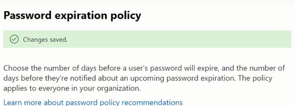

# Password-Expiration-in-Microsoft-365
Configure the Password Expiration to 100 days expire. 30 days notification

<h2>Description</h2>
Lab consists of a create Password Expiration Policy by using Microsoft 365 Admin Center. Password expiration is a dying concept. Essentially, it's when an organization requires their workforce to change their passwords every 60, 90.   If we want to prevent our users from recycling old passwords, we can do so by enfrocing by changing password on regular basis. In this Lab, we will set policy days of password expiration and getting of its notification.
<br />


<h2>Environments Used </h2>
- <b>Microsoft 365 Admin Center Portal </b>

<h2>Prerequisites</h2>

-<b> Password Expiration policy can be created or modified by anyone assigned the following roles:
 - Security Administrator
 - Global Administrator
 </b>

<h2>Program walk-through:</h2>

<h3>Steps: </h3>

1.  Go to Microsoft 365 Admin Center --> Settings --> select ‘Org Settings’
2.	Go to Security & Privacy tab --> Select ‘Password Expiration policy’
3.	Enter the value of ‘Days before password expires’ and ‘Days of notified’
4.	Save


<h3>Screenshots:</h3>

<p align="center">
Organization Settings:  <br/>

<br />
<br />
Security and Privacy Tab: <br/>

<br />
<br />
Set Password Expiration Days: <br/>

<br />
<br />
Result: <br/>

<br />
<br />


</p>

<!--
 ```diff
- text in red
+ text in green
! text in orange
# text in gray
@@ text in purple (and bold)@@
```
--!>
